

  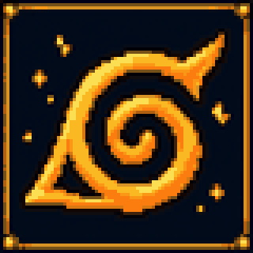

<h1 align="center">Terruto</h1>

Naruto Part I, from the Land of Waves to the Chunin Exams.

  
  

  
  
  
  
  

---

Terruto is a Naruto fan mod for tModLoader. It follows the story of Part I alongside Terraria's existing progression, with all vanilla bosses retained. You start in the Hidden Leaf Village, travel to the Land of Waves with Kakashi's guidance, and return for the Chunin Exams after completing the mission.

## Game content

Development has reached the Chunin Exams arc. The sprites below are taken from the current game assets; the boss previews loop their idle animations. Some other characters still use placeholder art, and the exam fights and sites are being refined through playtesting.

### The Land of Waves

You meet Tazuna by the coast, survive an ambush by the Demon Brothers, and free Kakashi from a water prison at the lake. The mission then leads to the unfinished bridge, where Zabuza and Haku fight together.

| Zabuza Momochi | Haku |
| :---: | :---: |
| 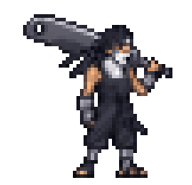 | 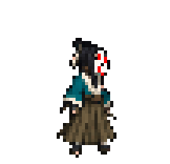 |
| Heavy sword swings, sudden dashes, and water jutsu. As the mist thickens, his attacks become harder to track. | Senbon volleys and movement between ice mirrors. The mirrors form a breakable cage around the player. |

Defeating one changes the remaining boss's behaviour, so the order in which you fight them matters. Once both have fallen, the snow and dialogue bring the arc to a close.

### The Chunin Exams

After Ibiki's written test, Anko gives you one scroll at the forest entrance. Defeat the entry squad, survive the encounter with Orochimaru, and take the missing scroll from the Rain trio near the tower. Bring both scrolls inside and speak to Hayate to start the preliminary fight against Dosu. After passing, defeat Skeletron or reach 400 maximum life to face Gaara outside the village walls. Kakashi also offers optional sparring against Neji during the finals.

Orochimaru first appears as a lone Grass Village candidate. Once revealed, he attacks with snakes, venom, snake rain, the Kusanagi sword, and a summoned giant snake. His killing intent has a red warning cone: move out or break his line of sight. Reduce him to half health, hold out for the required time, or fall during the first encounter to finish the scene and receive the one-tomoe Sharingan.

  

| Dosu Kinuta | Gaara | Neji Hyuga |
| :---: | :---: | :---: |
|  |  |  |
| The Central Tower's preliminary opponent. His arm drill, sound waves, ground quakes, and plunging attacks demand different ways to dodge. | The finals opponent. His sand defence gives way to cracked armour and a partial transformation as his health falls. | An optional fight built around Gentle Fist, Rotation, and Sixty-Four Palms. Chakra seals can cut off your substitution technique. |

Gaara attacks with sand shuriken, marked quicksand pillars, and pellets while moving. In his first two phases, a sand wall greatly reduces frontal damage while his back remains open; it is followed by two seconds of recovery. Cracked armour brings denser attacks, and his partial transformation switches to a giant sand arm and air bullets.

  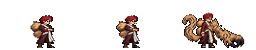

### People around the village

The Hidden Leaf Village is generated at spawn in new worlds and serves as a base between missions. Kakashi points you towards the next part of the story and helps you practise substitution. Tazuna waits by the coast, while Ibiki and the Third Hokage have their own roles back in the village.

| Kakashi Hatake | Tazuna | Ibiki Morino | Hiruzen Sarutobi |
| :---: | :---: | :---: | :---: |
| 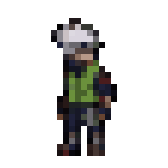 | 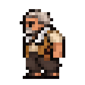 | 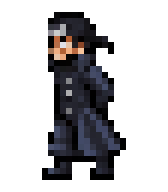 | 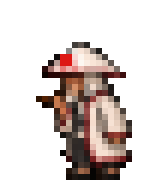 |
| Mission guidance, substitution practice, and the exam recommendation. | The bridge builder whose escort mission starts the Land of Waves arc. | The examiner who starts the written test at the Ninja Academy. | Advice on style cores and the chance to choose your ninja path. |

### Chakra, substitution, and stealth

Chakra is separate from vanilla mana. You start with two substitution logs: an enemy hit automatically spends one, cancels the hit, and moves you aside. There is no key to time before a hit. A log returns every 20 seconds, with successful attacks speeding recovery slightly.

Press **F** to spend two logs and 15 chakra on a blink in your movement direction and **five seconds of stealth**. Your next eligible weapon hit is guaranteed critical and gains 30% final damage; minions and sentries do not use this bonus. Logs or clones also take a warned Sand Coffin or killing intent in your place. Without protection, dodge the warning; F no longer directly breaks a bind. Kakashi's timed substitution drill remains a separate practice mode.

Style cores use **V** for their techniques and can be combined with equipment for the vanilla classes.

| Sharingan | Eight Gates | Byakugan |
| :---: | :---: | :---: |
|  | 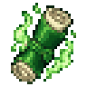 | 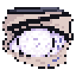 |
| Logs return every 16 seconds; Foresight evades the next hit without spending a log. | Faster taijutsu attacks and a technique that opens the first three gates in sequence. | See enemies through walls, seal their chakra points with melee hits, and use Rotation. |

### Hand-seal jutsu

Place scrolls in the **2-, 4-, and 6-seal slots** beside the ammo slots in your inventory. Tap **Z / X / C** to cast from the corresponding slot: the character forms the seals automatically. Movement slows and weapons cannot be used during weaving. A hit that reaches you interrupts it; one taken by a log or clone does not. These jutsu spend chakra and use general damage bonuses, with cooldowns shown on the HUD.

| Clone Jutsu · 2 seals / Z | Fireball Jutsu · 4 seals / X | Chidori · 6 seals / C |
| :---: | :---: | :---: |
| 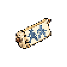 | 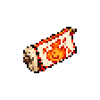 | 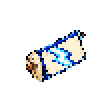 |
| 15 chakra. Two clones each take one hit before a log, lasting up to eight seconds. Equipped in the 2-seal slot at the start. | 40 chakra, six-second cooldown. A huge fireball passes through blocks and small enemies, leaves ground fire, and bursts on a boss or large enemy. | 60 chakra, ten-second cooldown. After the seals, lightning gathers for 1.5 seconds with a charge bar, then a dash reaches up to 40 tiles, passes through thin walls, and leaves lightning behind; the first boss stops it. |

Fireball and Chidori are available for development playtesting through `/m0 seals`. Their normal exploration, drop, and teaching routes are still to come. The ninja shop, new armour, and broader weapon redesign remain planned content.

### Weapons and mission items

The Land of Waves rewards include weapons for all four vanilla classes. The Kubikiribocho is a heavy melee blade, senbon are reusable ranged needles, Water Dragon is a magic attack, and Ice Mirrors summon mirrors that fire senbon at enemies.

| Kubikiribocho | Senbon | Water Dragon Jutsu | Ice Mirror Jutsu |
| :---: | :---: | :---: | :---: |
| 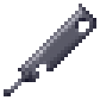 | 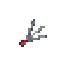 | 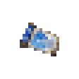 | 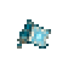 |
| Melee | Ranged | Magic | Summon |

The Ninja Handbook gives you clues about missions and bosses. During the Forest of Death test, you need both scrolls before you can finish the stage at the Central Tower.

| Ninja Handbook | Heaven Scroll | Earth Scroll |
| :---: | :---: | :---: |
| 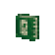 | 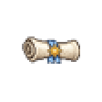 | 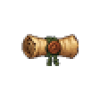 |
| Consult it when you need a lead on where to go next. | Collect it in the Forest of Death. | Pair it with a Heaven Scroll to complete the second test. |

## Playing and building

The mod runs on tModLoader for Terraria 1.4.4. **Start a new world** when playing for the first time: the village, coastal bridge, and exam sites are placed during world generation and are not added to existing worlds. Playtesting has focused on single player; multiplayer has not been verified. The Ninja Handbook and Kakashi's dialogue provide clues about where to go next. All in-game text is available in English and Simplified Chinese, following the game's language setting.

The Chinese [Wiki](wiki/README.md) covers items, bosses, mechanics, and story progression. From the repository root, run `python3 -m http.server 8765 --bind 127.0.0.1 --directory wiki/site` and open `http://127.0.0.1:8765/`. The site has not yet been publicly hosted.

To build from source, place or symlink the repository's `ShinobiPrototype/` directory in tModLoader's `ModSources/` directory. Open **Workshop → Develop Mods** in the game and select **Build + Reload**.

The project is developed on macOS. Setup instructions are in [DEVELOPMENT_MAC.md](DEVELOPMENT_MAC.md), written in Chinese. You can also run `./scripts/verify-mac.sh` from the repository root to run the rule tests and build the mod package. Close the game before packaging with the script, since it holds the mod file open while running. Use Build + Reload for rebuilding in the game.

Single-player debug commands

Enter `/m0` to see the full command list. These commands let you jump between story stages, watch the epilogue, or visit the exam sites during playtesting.

| Command | Effect |
| --- | --- |
| `/m0 god on` / `/m0 god off` | Enable or disable invincibility |
| `/m0 story 1` through `/m0 story 5` | Jump to a Land of Waves mission stage |
| `/m0 epilogue zabuza` | Play Zabuza and Haku's epilogue |
| `/m0 exam ForestGate` | Set progress to just after the written test |
| `/m0 exam gate` / `/m0 exam tower` / `/m0 exam stadium` | Teleport to the forest entrance, Central Tower, or finals stadium |
| `/m0 exam rebuild` | Rebuild the Forest of Death site in the current world |
| `/m0 orochimaru` | Spawn Orochimaru in his candidate disguise |
| `/m0 seals` | Receive the three implemented jutsu scrolls for development playtesting |

## Development

The mod source and textures are in `ShinobiPrototype/`, and the arc designs are in `specs/`. The `tests/` directory contains rule tests and in-game acceptance checklists. Logic for enemy spawns, boss move selection, and site layouts is kept independent of Terraria so it can be tested on its own. GitHub Actions runs these tests on pushes to `main` and on pull requests.

Art requests and deliveries are in `art/`. Build scripts, world generation checks, and pixel art tools are in `scripts/`; earlier documents are archived in `docs/archive/`. Run `python3 scripts/export_readme_assets.py` with Pillow installed to refresh the sprite previews after changing game textures. See [CONTRIBUTING.md](CONTRIBUTING.md) for playtesting feedback, bug reports, and contributions. The design documents and contribution guide are currently written in Chinese.

## License

This is an unofficial fan project. The code and original art are released under the [MIT license](LICENSE). Naruto's characters, names, and designs belong to Masashi Kishimoto, Shueisha, and their respective rights holders; Terraria belongs to Re-Logic. The public repository contains no anime soundtracks, voice recordings, or official images. See [NOTICE](NOTICE) for the rights statement.
