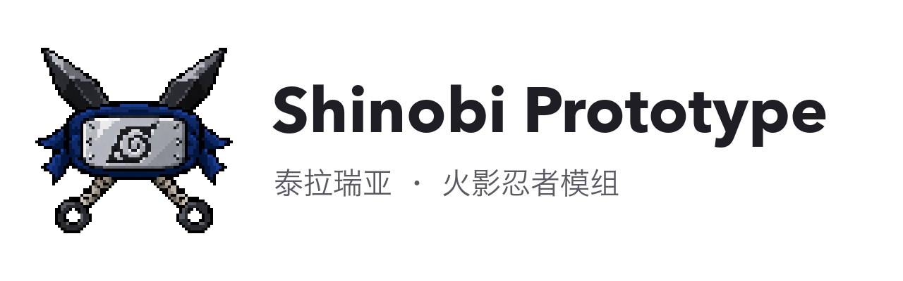

  <picture>
    <source media="(prefers-color-scheme: dark)" srcset="docs/images/banner-dark.png">
    
  </picture>

  
  
  
  
  

以《火影忍者》第一部为背景的泰拉瑞亚模组，目前仍在开发中。

---

Shinobi Prototype 是一个基于 tModLoader 的《火影忍者》同人模组，将第一部的故事融入泰拉瑞亚的冒险流程。模组保留了原版的全部 Boss，火影的任务与战斗随着探索进度逐步展开。玩家从木叶出发，在卡卡西的引导下前往波之国，完成任务后回村参加中忍考试。

## 游戏内容

目前的开发进度到中忍考试篇。波之国篇已经可以完整游玩：从海边与达兹纳见面开始，经历鬼之兄弟的伏击，在湖边解救被水牢困住的卡卡西，随后前往尚未完工的大桥，与再不斩和白交战。两人倒下后，剧情会进入这一篇的尾声。

中忍考试从伊比喜主持的笔试开始。通过笔试后，玩家进入死亡森林收集天地卷轴，在中央塔参加与音忍多斯的预选赛，最后前往木叶城墙外的会场，与我爱罗进行正式赛。这一篇的主要流程已经实现，目前仍在通过实机试玩调整战斗、引导和场地，部分角色还在使用占位贴图。

模组加入了独立的查克拉资源和替身术。替身术默认使用 F 键，需要在即将受到攻击时发动。写轮眼、八门和白眼以流派核心的形式加入，可以搭配原版职业使用。新世界的出生点会生成木叶村，作为剧情推进和日常活动的据点。

## 试玩与编译

模组运行于 Terraria 1.4.4 对应的 tModLoader。首次游玩需要**新建世界**，木叶村、海边的大桥和考试场地都会在世界生成时建造，旧世界不会自动补上这些内容。目前的试玩与验证以单人模式为主，联机体验尚未验证。游戏中的忍者手册和卡卡西的对话会提供后续任务的线索。

从源码构建时，将仓库中的 `ShinobiPrototype/` 放入或链接到 tModLoader 的 `ModSources/` 目录，再进入游戏的「Workshop → Develop Mods」，选择 Build + Reload。

项目在 Mac 上开发，环境配置见 [DEVELOPMENT_MAC.md](DEVELOPMENT_MAC.md)。也可以在仓库根目录运行 `./scripts/verify-mac.sh`，依次执行规则测试并构建模组包。使用脚本打包前需要退出游戏；游戏运行时会占用模组文件，此时可在游戏内使用 Build + Reload。

单人模式调试指令

试玩时可以通过 `/m0` 查看完整的调试指令。以下指令可用于跳转剧情、查看尾声或前往考试场地。

| 指令 | 作用 |
| --- | --- |
| `/m0 god on` / `/m0 god off` | 开启或关闭无敌 |
| `/m0 story 1` 至 `/m0 story 5` | 跳转到波之国任务的指定阶段 |
| `/m0 epilogue zabuza` | 播放再不斩和白的尾声 |
| `/m0 exam ForestGate` | 将进度设为通过笔试 |
| `/m0 exam gate` / `/m0 exam tower` / `/m0 exam stadium` | 传送到死亡森林入口、中央塔或正式赛会场 |
| `/m0 exam rebuild` | 重建当前世界的死亡森林场地 |

## 开发资料

模组源码与贴图位于 `ShinobiPrototype/`，各篇章的设计文档保存在 `specs/`。`tests/` 包含规则测试和游戏内验收清单；刷怪条件、Boss 招式选择和场地布局等逻辑独立于 Terraria 编写，可以单独运行测试。向 `main` 分支推送代码或提交拉取请求时，GitHub Actions 会自动执行这些测试。

美术请求与交付记录位于 `art/`，构建、世界生成检查和像素图处理脚本位于 `scripts/`，早期文档归档在 `docs/archive/`。试玩反馈、问题报告和贡献方式见 [CONTRIBUTING.md](CONTRIBUTING.md)。

## 许可与说明

本项目是非官方的同人作品，代码和原创美术采用 [MIT 许可](LICENSE)。火影的角色、名称和设定属于岸本齐史、集英社及相关权利方，泰拉瑞亚属于 Re-Logic。公开仓库不包含动画原声、配音或官方图片，相关权利说明见 [NOTICE](NOTICE)。

---

**English:** Shinobi Prototype is a Naruto fan mod for Terraria, built for tModLoader 1.4.4. It follows the story of Part I alongside Terraria's existing progression and retains all vanilla bosses. The Land of Waves arc is playable from beginning to end; the Chunin Exams are implemented and undergoing playtesting, with some placeholder art still in use. A new world is required to generate the Hidden Leaf village, bridge, and exam sites. Multiplayer has not been verified. The code and original art are licensed under MIT; Naruto and Terraria remain the property of their respective owners.
