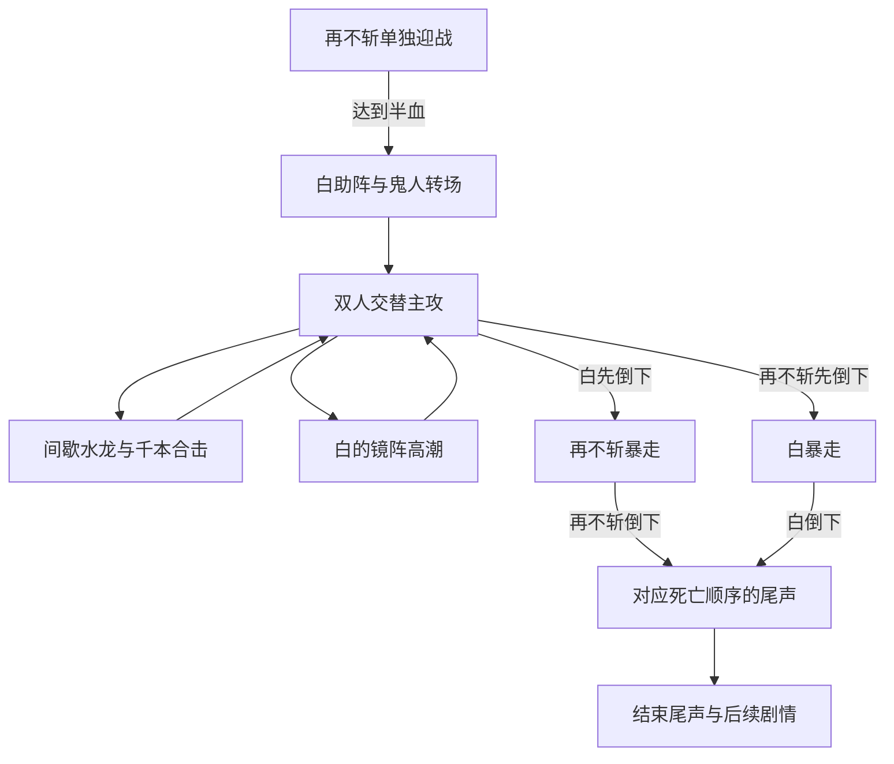

# M11 再不斩与白：战斗与特效完整设计

状态：**设计定稿，尚未实现或实机验收**。

定稿日期：2026-10-05。用户通过逐轮讨论确认 Q1–Q28，并明确要求「可以定稿，然后给出完整的设计文档」。本文件是本次改版的实施依据。

## 1. 范围、优先级与阅读方式

本次重设计对象是正式波之国双首领战中的再不斩与白，包括本体体量、追击、攻击组织、特效、跨地图战斗与死亡尾声。湖边初遇、森林友好白、城镇 NPC 和其他 Boss 不自动套用本战体型。

与 M9、M10 冲突时，以本文件为准；它们中的主线解锁、统一挑战卷轴、独立生命、旧档迁移、奖励、原版血条及已确认死亡剧情继续继承。敌方伤害口径与上限继续遵守《敌方伤害标准》。本文件不表示代码已经完成改版。

文档内分三种信息：

- **定稿要求**：用户已确认的玩法与美术方向，实施时应遵守。
- **首版初值**：用于制作可玩的第一版，由开发者提出，允许根据实机调整；不是用户逐个确认过的最终数字。
- **当前基线**：2026-10-05、Git `0917d0e` 的实际文件状态，供迁移核对；不等于新设计目标。

相关文档：

- [M9 双首领结构](</Users/tuzhechen/Documents/ChatGPT/泰拉瑞亚火影模组/specs/M9_波之国双首领战.spec.md>)
- [M10 既有优化与死亡尾声](</Users/tuzhechen/Documents/ChatGPT/泰拉瑞亚火影模组/specs/M10_波之国双首领战优化.spec.md>)
- [敌方伤害标准](</Users/tuzhechen/Documents/ChatGPT/泰拉瑞亚火影模组/specs/敌方伤害标准.spec.md>)
- [推荐配装](</Users/tuzhechen/Documents/ChatGPT/泰拉瑞亚火影模组/specs/推荐配装.spec.md>)
- [本版验收清单](</Users/tuzhechen/Documents/ChatGPT/泰拉瑞亚火影模组/tests/M11_波之国双首领战重设计.acceptance.md>)

## 2. 核心体验与平衡基准

**高速忍者交锋为主，大型忍术制造高潮。** 再不斩靠大刀、主动抢位与水龙形成压迫；白靠换位、千本与冰镜改变攻击方向。玩家通过读招、跑跳、换层、破镜和抓收招取得优势。

强大的视觉存在感由三个部分共同形成：明显大于玩家的人形本体、清楚的动作与机动、动画式流体与柔光忍术。普通攻击就应当好看，强招有完整演出，暴走进一步升级。

平衡基准为克眼后、玩家生命 200、同期推荐配装。基础跑跳在具备基本活动空间的场地里能够应对核心攻击；跑鞋、二段跳、钩爪、平台和替身增加优势，但不作为必备门槛。不以开发者翅膀、无敌、后期瞬身或无限替身验收。

熟悉招式后，正常配装从开战到两人倒下，目标约 **3–4 分钟**，不计死亡尾声。初见经过几次尝试能够掌握，少量失误后仍有恢复和调整机会。四种职业都要能通关；破招与熟练操作可以明显缩短战斗。

玩家可以选择或改造场地。把战斗带入狭窄洞穴时，需要承担活动空间不足的代价；Boss 不为此自动取消完整招式。预警与判定仍必须可靠，几何不利不能成为攻击不可见的借口。

## 3. 战斗结构与状态转换

用户明确满意现有双首领结构，本次保留：

### 3.1 一阶段与半血转场

- 开场只有再不斩，白不能提前攻击或显示为可击败的第二主体。
- 再不斩达到半血时只触发一次转场。致死或非致死的大伤害都不能越过这一门槛，转场前最低锁到半血。
- 转场沿用再不斩受创、浓雾扩散、白从冰镜登场、再不斩鬼人化的叙事方向；两人在转场期间受到保护，不进行普通攻击。
- 白生成与入场结束后，进入双人阶段。首版建议让白先展示一轮自由换位投针，再进入镜阵，便于玩家认识两个模式。
- 生成位置依次寻找双方附近的可用位置，再执行既有兜底。NPC 槽位耗尽属于异常，必须可靠中止或恢复挑战，不能把「白没生成」当作已击败白，也不能永久卡住转场。

### 3.2 双人阶段与击杀顺序

- 两人拥有独立生命与原版首领血条，玩家可以选择先打谁。
- 任意一人先真实死亡，立即结束当前双人合击/镜阵调度，幸存者仅触发一次对应暴走，不补满生命。
- 必须在同一场战斗中真实击败二人才统一结算。第一人死亡不发通关奖励或主线完成标志。
- 同一更新周期内两人都死亡时，按服务器记录的死亡事件顺序选择尾声；无法区分的完全同时事件采用固定、同步的顺序，避免客户端各播一套。短暂暴走状态可以没有机会出招，不强制延长已获胜的战斗。
- 玩家全部死亡或没有有效存活目标时，本战失败，清理攻击、镜子、状态与未完成尾声，下次从再不斩一阶段重开。多人中仍有存活参战者则继续战斗。
- 离开大桥、跨区域移动、离屏或 NPC 非死亡失活都不能误判为击杀。应有本场战斗身份、两个真实死亡记录与一次性结算标志。

## 4. 本体体量、造型与判定

### 4.1 定稿体量

| 对象 | 可见本体身高 | 计量范围 |
| --- | --- | --- |
| 再不斩 | 约玩家 3 倍 | 脚底至头发顶，不含大刀、刀光与鬼影 |
| 白 | 约玩家 2.5 倍 | 脚底至头发顶，不含镜子、残影与寒气 |

以正常游戏缩放下同屏玩家的**可见身高**为比较基准，不把透明画布或 NPC 碰撞框当作身高。若测得玩家可见高为 H，则目标约为 3H 与 2.5H；例：H=42 时约为 126 与 105 像素，仅用于估算。

人物保持已认可的像素角色方向，外貌与特征按角色分别设计。再不斩突出宽肩、大刀、绷带、护额与鬼人轮廓；白突出面具红纹、长发、衣袍与轻盈姿态。不得把城镇 NPC 的 62 像素身高、伊鲁卡的眼睛格数或无嘴线规定直接套给 Boss；口咬苦无必须可辨。

动作按最终游戏尺寸制作，先确认两人的站姿及关键攻击样张，再扩展动画。各动作共享脚底锚点和稳定身体中线；画布要容纳武器、跃劈和姿势，不能通过放大空白画布虚增体量。

### 4.2 伤害与受击

- 普通身体重叠不造成伤害。白的普通换位和镜间穿梭不添加身体撞击伤害。
- 伤害由刀刃、口部苦无和忍术危险主体承担。口咬苦无突进采用与可见攻击部位一致的局部判定，避免整个人物都成为伤害框。
- 可受击区域随可见躯干合理调整；鬼影、衣摆外围、刀光余波、柔光和残影不是本体受击框。
- 同一攻击不得叠加身体与武器两份伤害。一次性判定按攻击身份记录每名玩家是否已命中，被替身挡下也算本次命中。
- 初版把一组刀术短连段视为一次施放，共享玩家命中记录，避免多段动画重复扣血。若将来改成逐段伤害，必须另行审查连段总伤害与可躲性。
- 暴走投刀继承去程、回程各可命中一次的既有例外，回程必须能看清，不能误写成整次施放只伤一次。

## 5. 再不斩：移动与攻击卡

### 5.1 主动追击

以落脚和持刀发力为主，通过跳跃、空中突进与水雾瞬身适应平台、斜坡和高度差。瞬身成为主动抢位手段：接近路线不佳、玩家转层、距离过大时可以提前调整位置，不只是卡住两秒后的补救。

瞬身落点先出现水雾提示。隐去、移动、现身阶段无身体伤害；现身后须完成可见起手再出刀。普通移动不常驻悬空，攻击移动阶段允许穿地形；落地时寻找适合新体型的可用位置。

无法在玩家附近找到落点时，选择附近可见空地蓄势，再通过有预警的穿地形突进追击，避免连续找点导致失能。不得破坏或清除玩家方块来腾出落点。

### 5.2 有节奏的刀术短连段

| 项目 | 设计 |
| --- | --- |
| 目的 | 近身推进，要求玩家读动作、换方向或换层 |
| 首版一阶段 | 横斩 → 跃劈，两段 |
| 首版双人阶段 | 横斩 → 追斩 → 跃劈，三段 |
| 预警 | 举刀、肩部蓄力、刀锋水光；后续改变方向的刀段也需有清楚动作提示 |
| 执行 | 刀锋真实扫过危险区域，最后跃劈动作最大；在可辨时点锁方向，不持续追踪玩家修正刀锋 |
| 应对 | 读刀锋、移动或跳落平台；不要求跳过整个巨大本体 |
| 收招 | 收刀、拔刀或稳住姿态，给明确的输出窗口 |
| 特效 | 流动水光、弯曲翻卷的刀迹，末击向两侧扩散水花与冲击纹 |

跳跃和突进负责把连段送到合理距离，不等于每次贴脸瞬移后立刻判定。普通重劈的地面冲击纹属于余波演出，不另加未预警的整片地面伤害。

### 5.3 水龙

| 项目 | 设计 |
| --- | --- |
| 目的 | 大尺度强招，逼玩家跳跃、下落或换层 |
| 聚势 | 结印、水流盘旋汇聚，先形成龙头；显示清楚的预定路线 |
| 锁定 | 发射前锁定方向；释放后沿既定路线前进，不继续追踪 |
| 执行 | 张口龙头、弯曲流动龙身、翻卷浪流与柔光拖尾贯穿战线 |
| 地形 | 穿平台和实心障碍；不改变世界方块、墙、液体或玩家建筑 |
| 应对 | 提前选择换层路线；普通跑跳在基本开阔空间里可通过 |
| 收招 | 结印结束的恢复姿态，给短反击窗口 |
| 余波 | 龙身逐段崩散成水花，浪流与泡沫消退；余波无伤害 |

龙身危险主体必须与实际判定对应。夸张外围水浪可以更大、更透明；不能画出一条实心发亮的大龙，却仅用隐藏细线伤人。最终危险厚度以普通跳跃与平台测试为依据。穿墙时仍能看到路线与危险轮廓。

本版首选的主动破招目标是冰镜；水龙的反击机会是躲过后的收招，不额外增加未经本轮确认的强制打断结印机制。

### 5.4 旧招式迁移边界

首版常态攻击池围绕刀术短连段、水龙和有预警的刀锋突进组织。旧水浪、水针扇、水针雨、螺旋水针等资产和实现可保留作迁移参考，但不默认全部叠回新攻击池。旧镜间撞击也不能作为白的额外身体伤害。后续扩招需单独验证职责、可读性和调度。

## 6. 白：自由模式与镜阵模式

### 6.1 自由移动

循环为：**换位 → 短暂停留与投针预警 → 一轮千本 → 收招 → 换位**。

- 白能悬空、穿地形移动，在玩家附近寻找可见且有射击角度的位置；普通换位无伤害。
- 停留投针时可受击，不能一直高速运动导致玩家只能追着小目标射击。
- 首版一轮以少量扇形千本为主，预先显示来向，发射后不追踪。玩家通过横移、跳跃、下落或建筑遮挡应对。
- 普通千本穿单向平台、被实心方块挡住；碰实心后消散，碰地冰晶不再追加伤害。白主动换位获取视线，避免在墙后持续放无效针。
- 换位有冰蓝残像，掌边寒气汇聚；针尖明亮、针迹细长，命中或消散形成冰晶。

### 6.2 魔镜冰晶牢笼

普通双人阶段的镜阵是一个**可破、定点、限时**的临时术式。释放时锁定中心，结束前不跟随玩家移动；镜阵不永久改造地形。

1. 白进入施术姿态，镜面沿圈周逐面结晶成形，牢笼边界渐显。
2. 玩家被困在圈内，但已有平台、高低差与方块保留。边界先可见，再启用限制与边界伤害。
3. 白在镜内受到保护。即将出手的镜子亮起，白现身或穿梭时可被攻击，随后投出少量千本。
4. 玩家可以躲针，也可以破坏镜子。打碎规定数量后提前破阵；未破阵则按持续时间自然结束，不能无限关住玩家。
5. 成功破阵触发明显失衡、较长硬直和短暂易伤，留出普通玩家接近白并输出的时间。自然结束只提供较短恢复窗口。
6. 镜阵期间再不斩在圈外移动蓄势，不造成辅助攻击伤害。白的破阵奖励窗口结束后，再不斩经过明确预警接棒。

镜面、冰框、白的剪影、裂纹和出手镜必须能区分。开阔场地中的镜子受击区域应可见且合理可达，近战、远程、魔法、召唤均能参与破镜；召唤物目标选择不能只追无敌白。狭窄地形的活动空间不利由玩家承担，但镜阵仍须可靠结束和清理。

玩家打掉某面镜子后，该镜不能继续成为本次攻击的出发点；选择下一面有效镜时重新预警，不能从已经消失的镜子无提示射针。

## 7. 双人协作与标志合击

### 7.1 主攻交替

应有统一的强招调度，双方不能各自独立计时后同时发动强招。普通双人阶段由一人持有主攻权，另一人保持辅助姿态；若使用少量普通千本辅助，也必须保留主攻所要求的安全路线。

| 状态 | 再不斩 | 白 | 强招规则 |
| --- | --- | --- | --- |
| 再不斩主攻 | 刀术或水龙 | 换位、观察，可有经验证的少量普通针 | 不启动镜阵或另一独立强招 |
| 白自由主攻 | 移动蓄势 | 停留投针、换位 | 再不斩不突然开始贴脸连段 |
| 镜阵 | 圈外移动蓄势，无伤害 | 完整镜阵循环 | 合击与独立再不斩攻击暂停 |
| 合击 | 水龙 | 后续区域千本 | 仅执行同一脚本的两步 |
| 破阵奖励窗口 | 蓄势待接棒 | 失衡、可输出 | 再不斩不抢掉玩家奖励窗口 |

### 7.2 水龙逼换层、千本接落点

- 仅在两人都存活、白处于自由模式、没有镜阵或未结束奖励窗口时进入。
- 第一步：再不斩结印、锁定路线、释放蓝绿色水龙，逼玩家换层。
- 第二步：白提前显示将攻击的部分落点或区域，随后释放冷白/冰蓝千本。第二步拥有自己的可见预警。
- 两步先后清楚，不能在第一步逼出的所有合理出口同时投针；在基础跑跳与玩家平台的基准场地里，至少保留一条可达安全路线。
- 白的区域锁定后，不在玩家刚选择安全区时再动态补针。针被实心障碍挡住的规则保持。
- 不额外叠加刀术、针雨、螺旋、水龙第二发或镜阵。合击结束双方短暂恢复，之后交回普通主攻循环。
- 若一人死亡、目标无效或战斗失败，立即取消尚未释放的后续步骤，按死亡/失败状态转移；已存在的危险实体应在规定清理点取消伤害。

## 8. 两种暴走

### 8.1 白先倒下：再不斩暴走

保留原有情绪与台词方向。再不斩舍弃水遁，专注凶狠刀术、投刀与口咬苦无突进。

- 开场有短暂停顿、鬼影变化与清楚的暴走启动，之后继续追击玩家。
- 连段节奏更紧，追斩与空中突进更主动，但保留可辨起手和收招。
- 大刀投出、旋转飞行、去程与回程都可伤人；宽旋转尾迹显示运动方向。刀不在手时，口咬苦无突进；接刀时爆出查克拉冲击环。
- 投刀的去回各一次命中规则保持，不能加旋转余波的额外伤害。口咬苦无只用局部攻击判定，不叠全身接触伤害。
- 紫色鬼影随重斩伸展、压下，查克拉如烟焰包住人物。鬼影和外围烟焰不伤人，也不作为可受击身体。
- 沿用现有暴走时受伤提高约 25% 的起点，不因暴走补血。是否需要微调属于平衡实测。

### 8.2 再不斩先倒下：白暴走

保留强化冰镜、冰遁与千杀水翔的既有方向。

- 短暂停顿后寒气增强，镜面寒光和裂纹升级，持续镜环与更快的镜间移动形成压力。
- 暴走镜环沿用缓慢跟随玩家、镜子损坏后延迟重生的方向；它不等同于普通牢笼的固定边界，不把玩家永久推回。
- 镜内保护与现身可受击关系保持。破坏镜子减少攻击节点和来向；现身、穿梭、强招收招期间提供可命中的机会。
- 低血量使用千杀水翔：悬浮针阵成形，针尖依次亮起，留下可辨的缺口，再按预警路线齐射；结束散成冰屑，白有恢复姿态。
- 高速不能把高伤害强招的预警压低于伤害标准，也不能以补满屏幕针数代替阶段变化。
- 普通破阵的长硬直/易伤机制与暴走持续镜环需分开处理；首版不额外新增终结大招，不让连续破镜造成无限硬直。

## 9. 特效完整规范

### 9.1 已确认的美术基调

**人物是像素角色，攻击特效采用动画式流体、柔光、寒气与能量效果。** 用户选择的是 Q26.C，不能改回「所有特效硬边像素化」或仅允许外围柔光的方案。

水、冰和查克拉的主体也可以具有柔和边缘、透明度变化与连续流动。辨识度通过主体形状、亮度层级、运动方向和独立预警保证。

| 层 | 功能 | 表现要求 |
| --- | --- | --- |
| 聚势/预警 | 告诉玩家谁要出招、攻击哪里、何时释放 | 姿态、亮镜、针尖、路线；在地形和效果叠加下仍清楚 |
| 危险主体 | 表示实际攻击区域 | 刀锋、龙身、针尖等有明确轮廓；与判定对应 |
| 流动与柔光 | 形成体量和力量感 | 水幕、寒气、光晕、残像有主次，不掩盖危险主体 |
| 余波 | 表示招式结束与冲击消退 | 水花、晶片、烟焰、冲击纹逐渐消失，无额外伤害 |

色彩分工：再不斩水遁以蓝绿为主，刀刃带亮水光；鬼人查克拉为紫色。白以冷白、冰蓝、透明镜面和寒气为主。合击依靠颜色和先后动作区分来向。

### 9.2 演出层级

- **常态漂亮**：每次挥刀都有可见水光与轨迹；千本有明亮针尖、冰痕；换位有残像。普通招不能只剩几个难辨光点。
- **强招壮观**：水龙具有龙头、龙身、翻卷浪流和崩散过程；镜阵有逐面成形、镜中剪影、亮镜穿梭与碎裂过程；合击有清楚的两步接力。
- **暴走震撼**：扩大鬼影的姿态表现、加强旋转刀迹和接刀冲击；白增强镜面寒光与悬浮针阵，但仍留可读空间。

### 9.3 镜头、背景与音效

用户选择短促轻微震动、少数强招短暂压暗背景。镜头仍以玩家正常游玩为中心，不强制长时间转向或锁定 Boss。

适用节点：连段末次重劈、水龙释放、成功破阵、暴走启动。普通千本和每次轻斩不反复震屏。首版建议震动 0.10–0.18 秒、位移约 2–4 屏幕像素；背景压暗约 15%–25%、持续 0.20–0.35 秒，均为可调初值。

预警、危险主体、玩家轮廓、血条与 UI 保持可见，背景压暗不能同时压掉它们。采用冰蓝环境氛围变化替代长时间全屏强闪，特效开关/强度与项目现有设置方式衔接。

音效按起手、释放、冲击与破招分别组织：重斩与水龙有不同的低频冲击，白的投针和镜碎有清楚的高频冰晶声音；合击保留两步声音间隔。版权素材与音乐分发仍遵守既有本地使用规则。

### 9.4 特效素材与运行要求

- 人物与特效采用不同的透明度处理：人物按像素轮廓导出；柔光、流体和寒气保留半透明边缘，不能通过人物导出管线自动二值化或限色。
- 按刀光、水龙、投针、冰镜、鬼影、针阵分别制作代表样张和短循环，再做组合演出。先在真实游戏视野、明暗背景和平台场景验证，不一次性提交整套未确认的大批动画。
- 位图需求按 art/AGENT_HANDOFF.md 写请求、走桥接交付；轨迹、镜面变化和可复用光效可以使用合适的代码绘制。效果服务于游戏表现，不强制把每一帧都作为独立生图素材。
- 保存锚点、朝向、持续时间、帧数、是否属于危险主体等交付元数据。左右翻转后，刀锋方向与判定也必须一致。
- 复用资源，限制同时存活的装饰粒子、拖尾长度和离屏演出；危险主体与预警不可因特效降级而消失。每帧不重复读盘加载纹理，不按战斗次数无限累计实体。
- 使用同一场景、相同缩放、相同机器做开启/关闭特效的帧时间与资源对比。具体性能预算由基线测量后确定，不凭构建通过宣布流畅。

## 10. 场地、建造与世界追击

### 10.1 大桥作为剧情起点

沿用现有大桥、岸边、小岛与脚手架，提供基础通行面和少量落脚点。不开战重刷场地，不自动建成完整三层竞技场，不强制玩家使用预制布局。

玩家新增平台、横向延伸、挡针墙体及其他建筑均保留。新世界可在原场景中安排必要基础空间；旧世界的补充或施工应采用现有安全流程，不覆盖自建内容。

本次决策同时确立后续设计原则：优先利用现有世界地形和招式临时形成的战斗空间；永久场景只为必要剧情节点设置，不为每个 Boss 预留独立的大型竞技场，也不在本战引入新子世界。

### 10.2 自由转移战场

大桥仍是既有卷轴与剧情的开战地点，开战后允许一路追到世界其他区域。距离桥远、到其他生物群系、天亮或离开桥雾范围都不是本战的新失败条件。

再不斩主动瞬身与穿地形攻击维持距离，白飞行/穿镜跟随。存在有效存活目标时，不应因默认离屏退场检查丢失一人或误发奖励；需要为本战处理保活、远距离恢复与链接同步。

Boss 不清除玩家方块，不要求附近有真实水体才能施展水遁。普通千本可被实心遮挡，水龙继续穿障碍；狭窄环境不自动删招。环境不利由玩家承担，但 Boss 自身不能因寻路失败而永久停止。

两人在多人目标切换后应围绕实际协作目标安排合击；目标失效则取消或重新完整预警，不把已锁定合击的一半突兀转给远处另一名玩家。

## 11. 死亡尾声与后续剧情

用户认可的死亡顺序、台词与动作沿用 M10 及现有尾声时间线：最后倒下的人尝试靠近先倒下的人，播放对应分支，雪渐显并在尾声结束时渐稀。

### 11.1 落点与汇合

- 尾声在**最后击杀地点附近**播放，不强制返回大桥。
- 第一人死亡时记录本场身份、角色、顺序和位置；死亡表现可留在当地。第二人死亡后，由服务器决定尾声锚点。
- 两具尸体本来靠近、同一可用地面、短路径可行时，自然衔接已有动作。
- 距离过远、隔墙、上下错层、位于水下/危险液体等无法稳定演出的情况，用短暂雪雾或画面过渡，将两人的演出位置整理到最后击杀点附近的合适落脚处，再播放原尾声。
- 找不到自然落脚处时，使用不改世界方块的临时演出支撑/悬置方式处理；位置变化属于演出，不清除玩家建筑、不生成永久场地。
- 不要求尸体走过半张地图。过渡后两人距离应在现有踉跄靠近动作可完成的范围内；保持角色左右关系、死亡顺序与脚底对齐。
- 早先尸体已离屏、消失或超时，也必须能依据本场记录恢复正确演出，不能依赖旧弹幕还活着才播放尾声。

### 11.2 玩家、音乐与结算

- 不锁玩家输入，不强制传送玩家。尾声位置与开始时机应能被附近玩家看见；离开或未观看不阻断已经完成的战斗进度。
- 沿用已有战斗音乐、死亡分支音乐与卡卡西后续。桥场景音乐只影响桥附近环境，战斗音乐与尾声音乐需在实际战斗/尾声位置正确生效。
- 两次真实死亡之后只结算一次。沿用现有掉落与首杀奖励规则，大桥完工和主线解锁仍可在玩家远离大桥时完成。
- 大桥完工不能拆除玩家自建平台或同位置新放的同类材料；旧脚手架拆除逻辑需复核，不能仅凭方块类型认定属于生成场景。
- 尾声期间尸体、文字、雪与音乐同步；卡卡西后续要能找到当前有效玩家，远距离完成后仍能继续剧情。
- 本轮不另造对白分支、终结大招或新的强制过场操作。玩家可见新提示与说明全部进入中英 Localization，键和占位符一致，不在代码中写死文字。

## 12. 首版参数表：用于调试，不是最终平衡承诺

统一以 60 更新帧为一秒记录时序。下列数值是在既有参数基础上的第一版起点，必须结合动画实际可见时点、玩家基础移动和四职业实测调整。

### 12.1 本体与攻击时序

| 项目 | 首版初值/处理 | 来源性质 |
| --- | --- | --- |
| 再不斩生命 / 防御 | 1800 / 7，先保持当前普通模式基值 | 当前基线 |
| 白生命 / 防御 | 900 / 4，先保持当前普通模式基值 | 当前基线 |
| 再不斩 / 白可见身高 | 3H / 2.5H | 用户定稿 |
| 再不斩刀术段数 | 一阶段 2，双人及暴走 3 | 首版初值 |
| 刀术首段起手 | 38 帧；暴走 26 帧 | 既有起点 |
| 后续改变方向的刀段 | 至少 24 帧可见动作提示 | 伤害约束与首版处理 |
| 刀术末击收招 | 常态 48 帧，暴走 36 帧 | 首版初值 |
| 水龙聚势/预警 | 62 帧，后段明确锁定路线 | 既有起点 |
| 水龙收招 | 60 帧 | 首版初值 |
| 主动瞬身自身冷却 | 约 4 秒；非追击失联时避免连续瞬身 | 首版初值 |
| 瞬身现身后的危险近身攻击 | 重新起手，强招至少 24 帧 | 伤害约束 |
| 白自由投针起手 / 恢复 | 36 / 38 帧 | 既有起点 |
| 白自由千本数 | 初版 3 发，保持清楚间隙 | 首版初值 |

生命不能仅因体型放大就机械翻倍。先测活动输出、无敌占比、破招效率与实际时长，再调生命/防御和节奏；不得靠大量无敌等待凑满 3–4 分钟。

### 12.2 镜阵、合击与暴走

| 项目 | 首版初值/处理 | 来源性质 |
| --- | --- | --- |
| 普通镜阵镜数 / 半径 | 8 面 / 320 像素 | 沿用当前参数起点 |
| 每镜生命 / 提前破阵 | 60 / 打碎 4 面 | 沿用当前参数起点 |
| 成形与边界启用前预警 | 至少 40 帧，完整成形后启用危险 | 沿用与时序约束 |
| 镜阵攻击持续 | 约 8 秒，破镜可提前结束 | 沿用起点 |
| 镜阵再次开始间隔 | 自上一镜阵结束起至少 20 秒，且展示自由交锋 | 首版初值；替代旧约 15 秒起点 |
| 普通镜间周期 / 亮镜 / 露身 | 60 / 24 / 30 帧 | 周期沿用；亮镜提高作为初值 |
| 每次镜中扇射 | 3 发 | 沿用起点 |
| 自然结束恢复 | 45 帧 | 首版初值 |
| 成功破阵硬直 / 易伤 | 150 帧 / 受伤 +20%，期间再不斩不接伤害招 | 首版初值，保证接近与输出 |
| 合击冷却 | 结束后至少 24 秒，并与镜阵互斥 | 首版初值 |
| 合击第二步预警 | 至少 36 帧，独立于水龙起手 | 首版初值 |
| 合击后恢复 | 至少 45 帧 | 首版初值 |
| 再不斩暴走受伤提高 | 约 +25% | 沿用既有方向 |
| 白暴走镜数 / 半径 / 重生 | 6 / 300 像素 / 6 秒 | 沿用当前起点 |
| 白暴走镜间周期 / 亮镜 / 露身 | 42 / 24 / 24 帧，释放针与露身可重叠 | 首版初值；镜间预警更清楚 |
| 暴走千本扇数 | 5 发，首版验证后再调整 | 沿用起点 |
| 千杀水翔解锁 / 冷却 / 预警 | 白低于 30% / 12 秒 / 48 帧 | 沿用当前起点 |
| 千杀水翔针数 / 缺口 | 16 个逻辑位，连续留 2 位缺口；实际发射 14 | 当前参数口径 |

镜数与破镜要求需要按四职业测试；近战若难以接近，优先修镜位、白的露身与破阵窗口，而不是要求获得后期飞行。

### 12.3 伤害口径与初值

下表是普通模式防御前**目标伤害**，仍经过既有原版伤害浮动。沿用 EnemyDamage 工具：敌方弹幕内部处理原版倍率，不能直接把目标值传入生成函数，也不能重复除二。

| 攻击 | 首版目标伤害 | 命中次数/约束 |
| --- | --- | --- |
| 刀术短连段 | 48 | 整组对每名玩家一次 |
| 大刀突进 | 一阶段 50，鬼人化/暴走 60 | 每次突进一次，不叠身体 |
| 水龙 | 60 | 每条龙对每名玩家一次 |
| 自由千本 | 28 / 发 | 飞行路线清楚；同一枚针不重复伤同一人 |
| 镜阵千本 | 26 / 发 | 亮镜后释放 |
| 暴走千本 | 28 / 发 | 不以密度堆出不可躲局面 |
| 冰镜边界 | 10 | 沿用受伤冷却 30 帧 |
| 暴走投刀 | 56 / 程 | 去、回每程各一次，整次可伤两次 |
| 口咬苦无突进 | 20 | 局部攻击判定，每次一次 |
| 千杀水翔 | 38 / 发 | 高伤害预警至少 24 帧，初值 48 帧，留缺口 |

基准 200：普通招/持续伤害目标上限 30，大招上限 60。高伤害强招从第一个可见提示到判定至少 24 帧，暴走和连段加速不能突破；瞬间近身判定至少 15 帧提示。专家/大师/多人需分别实测实际生命、伤害与节奏，不把普通基值直接称为最终结果。

## 13. 当前实现差距与开发定位

以下是只读核查结果，不表示已修复。

| 范围 | 当前基线 | 新版需要落实 |
| --- | --- | --- |
| 本体体量 | 再不斩站姿可见约 92 像素，白约 72–76；受击框 36×84 / 28×68 | 按 3H / 2.5H 重做最终尺寸、动作锚点和合理受击区域 |
| 半血锁线 | CheckDead 处理致死跨线；非致死大伤仍可能跌过半血 | 统一处理临界伤害与多人同帧命中，转场仅一次 |
| 白生成失败 | 候选与落点有兜底，但槽满重试截止后会允许再不斩单独继续 | 不能把缺席白算击杀；异常有可靠恢复/中止路径 |
| 世界追击 | AI 有追击/瞬身，但未完整处理默认离屏保活 | 有存活目标时跨地图保持本战身份与双方链接 |
| 胜利判定 | 依赖另一链接 NPC 是否 active | 使用两次真实死亡账本、失败清理和一次性结算 |
| 每招命中记录 | 部分投射物已有 PlayerHits，刀锋冲刺等仍依赖短持续与受伤免疫 | 一次性攻击严格去重，身体与武器不叠伤 |
| 主攻调度 | 现有错峰与镜阵暂停 | 建立自由主攻、合击、镜阵、破阵奖励的统一互斥 |
| 死亡汇合 | 尸体重力下落，末人横向慢走，约 20 秒上限；无远距离/高差寻路 | 最后击杀附近安全落点与短过渡汇合 |
| 大桥完工 | 按原脚手架坐标/材料移除 | 复核自建同材料归属，保留玩家建筑 |
| 特效 | 现有像素与粒子版本 | 按 Q26.C 完整流体柔光演出，分别验证预警、危险主体与余波 |

主要实施入口：

- 战斗主体：[ZabuzaBoss.cs](</Users/tuzhechen/Documents/ChatGPT/泰拉瑞亚火影模组/ShinobiPrototype/Content/NPCs/ZabuzaBoss.cs>)、[HakuBoss.cs](</Users/tuzhechen/Documents/ChatGPT/泰拉瑞亚火影模组/ShinobiPrototype/Content/NPCs/HakuBoss.cs>)。
- 规则与伤害：[ZabuzaCombatRules.cs](</Users/tuzhechen/Documents/ChatGPT/泰拉瑞亚火影模组/ShinobiPrototype/Common/ZabuzaCombatRules.cs>)、[WaveDuoRules.cs](</Users/tuzhechen/Documents/ChatGPT/泰拉瑞亚火影模组/ShinobiPrototype/Common/WaveDuoRules.cs>)、[EnemyDamageRules.cs](</Users/tuzhechen/Documents/ChatGPT/泰拉瑞亚火影模组/ShinobiPrototype/Common/EnemyDamageRules.cs>)。
- 尾声：[WaveCorpse.cs](</Users/tuzhechen/Documents/ChatGPT/泰拉瑞亚火影模组/ShinobiPrototype/Content/Projectiles/WaveCorpse.cs>)、[WaveEpilogueRules.cs](</Users/tuzhechen/Documents/ChatGPT/泰拉瑞亚火影模组/ShinobiPrototype/Common/WaveEpilogueRules.cs>)、[WaveEpilogueSystem.cs](</Users/tuzhechen/Documents/ChatGPT/泰拉瑞亚火影模组/ShinobiPrototype/Common/Systems/WaveEpilogueSystem.cs>)。
- 场景：[WaveBridgeWorld.cs](</Users/tuzhechen/Documents/ChatGPT/泰拉瑞亚火影模组/ShinobiPrototype/Common/Systems/WaveBridgeWorld.cs>)、[BridgeBuilder.cs](</Users/tuzhechen/Documents/ChatGPT/泰拉瑞亚火影模组/ShinobiPrototype/Common/Systems/BridgeBuilder.cs>)。

## 14. 联机、兼容与异常

- 单人/服务端负责状态、目标、召唤、镜子、攻击实体、死亡序、尾声锚点、掉落和进度。客户端仅根据同步状态绘制，不能重复生成白、镜子或奖励。
- 同步攻击身份、主攻权、已锁路线、镜阵中心/有效槽位、阶段、关键开始时点与死亡序。装饰粒子可本地生成，危险轨迹不能因本地随机而不同。
- 联机预警先于伤害，网络补状态不能让一个迟收到消息的客户端直接跳到无提示攻击；稳定局域网与延迟场景分开记录实测结果。
- 白的牢笼沿用目标玩家约束和队友可从外破镜的方向；不无预警地把镜阵目标切给另一人。合击目标失效时重新完整预警或取消。
- 沿用已双通关旧档、单人旧通关标志处理、旧白卷轴转换与正式双首领入口。原版血条/头像、首杀与重复掉落规则继续使用。
- 任一异常失活、重连、全队死亡、生成失败都必须清理本场临时对象；不能留隐身、推回、无敌、敌方弹幕或锁定状态到下一场。
- 音乐缺失的既有回退继续有效；不把本地原声素材提交到公开仓库或随公开模组分发。

## 15. 实施顺序与完成标准

1. **规则与回归底座**：本场身份、真实双击杀、半血锁线、生成异常、主攻互斥、失败清理。先保住用户认可的双首领结构。
2. **本体与机动原型**：先确认真实尺寸站姿、刀术关键姿势、白投针/镜中姿势；实现主动追击、落点与局部伤害，验证玩家自建平台。
3. **核心攻击与反击**：完成刀术、水龙、白自由投针、镜阵破坏及奖励窗口；基础跑跳和四职业实测。
4. **合击与两种暴走**：加入一套水龙/千本接力，继承并升级两种暴走，验证错峰、收招与死亡中断。
5. **流体柔光特效**：完成代表招式样张与短演出，再扩大到全部动作；完成轻震、短压暗、音效和性能对比。
6. **跨地图与尾声**：完成远距离保活、死亡汇合、尾声锚点、桥完工与后续剧情；验证高差、障碍和远距离死亡。
7. **完整验收**：规则测试、构建、无头加载（适用时）、实机与联机分别记录。完成清单中的阻断项后才可宣布改版完成。

规则测试与构建成功只证明对应技术检查，不能证明战斗好玩、特效华丽或实机流畅。文档阶段不提交美术请求、不替换素材、不调整源码或平衡常量。

## 16. 用户决策追溯

| 问题 | 最终选择 | 落地要求 |
| --- | --- | --- |
| Q1 核心爽感 | A 为主，B 制造高潮 | 忍者交锋、读招反打，大型忍术高潮 |
| Q2 双首领构成 | A；明确保留现有结构 | 半血白加入、任一先死另一暴走、按死亡序尾声 |
| Q3 场地 | B，经 Q22/Q23 修订 | 桥主题起战场景，允许自建、跨地图，不是固定封闭竞技场 |
| Q4 体量 | A | 再不斩 3H、白 2.5H |
| Q5 再不斩移动 | A | 落脚、跳跃、空中突进、主动瞬身 |
| Q6 白移动模式 | C | 自由移动与镜阵交替 |
| Q7 玩家机动基准 | A | 基础跑跳可应对，平台/替身增加优势 |
| Q8 身体伤害 | A | 武器和忍术危险部位伤人，普通身体无伤 |
| Q9 刀术 | A | 有节奏的短连段，末击后明显收招 |
| Q10 水龙 | A | 沿预警路线贯穿，发射后不追踪 |
| Q11 白自由攻击 | A | 换位、停留投针、再次换位 |
| Q12 镜阵 | A | 可破冰镜牢笼，破足数量提前结束 |
| Q13 双人合击 | A | 一套间歇出现的标志合击 |
| Q14 反击奖励 | B | 自然短窗口，主动破招更大收益 |
| Q15 合击内容 | A | 水龙逼换层、千本接部分落点，自由阶段执行 |
| Q16 白受击 | A | 镜内保护，现身/穿梭可打，破阵长输出 |
| Q17 暴走 | A | 沿用各自既有方向，强化动作/机动/演出 |
| Q18 时长 | A | 熟悉后约 3–4 分钟，不计尾声 |
| Q19 难度 | A | 初见数次尝试可掌握，少量失误可恢复 |
| Q20 镜阵中再不斩 | A | 圈外蓄势，无伤害辅助，奖励结束后接棒 |
| Q21 忍术与墙 | A | 水龙穿实心，普通千本被挡 |
| Q22 默认平台 | A，并明确世界空间限制 | 基础通行面与少量落脚点，玩家可扩建，不给每个 Boss 永久大场地 |
| Q23 转移战场 | B | 可追到世界其他区域 |
| Q24 狭窄地形 | A | 玩家承担场地不利，完整招式继续 |
| Q25 尾声落点 | A | 最后击杀附近，自然衔接或短过渡整理位置 |
| Q26 特效质感 | C | 动画式流体与柔光，不能改成全硬边像素 |
| Q27 华丽层级 | A | 普通攻击明显、强招完整演出、暴走升级 |
| Q28 镜头反馈 | A | 重击轻震，少数强招短压暗 |

## 17. 本文件交付状态

设计与验收要求已整理；游戏代码、素材、参数、构建产物未因本次文档交付改变。规则测试、完整构建、无头加载、单人及联机实测均**未运行**。新设计实施进度由 WORK_HANDOFF.md 与后续提交记录，不从本文件「设计定稿」推断已实现。
